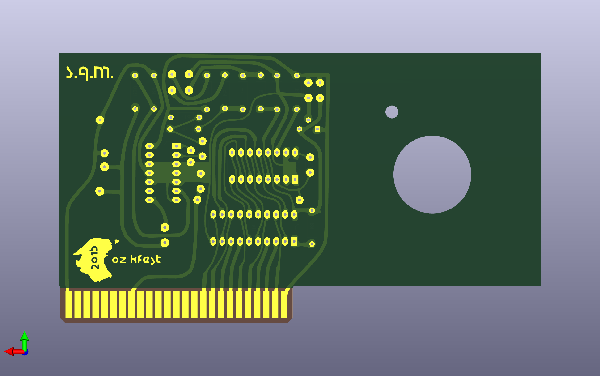

# A2_SAM
Clone of the Software Automatic Mouth card for Apple II.  Despite being supposedly "software only speech synthesizer", the Apple II version required a card containing a DAC.  A hack exists that does not need the card and uses the internal speaker, but this one has a lot of distortion.

SAM_libraries contain schematic symbols and footprints that are not in the standard kicad libraries.

SAM.zip contains the gerbers for the latest release.

Updates:

06/01/2025
Fixed slot dimensions (original was too big)

Removed solder mask from area around slot pins.

